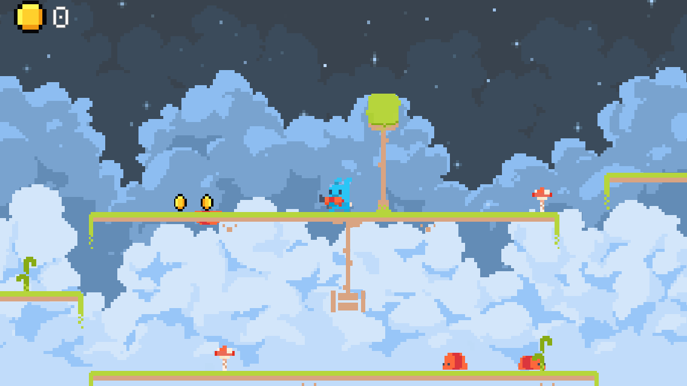
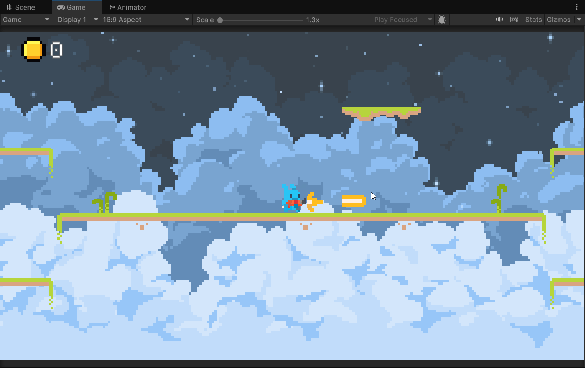
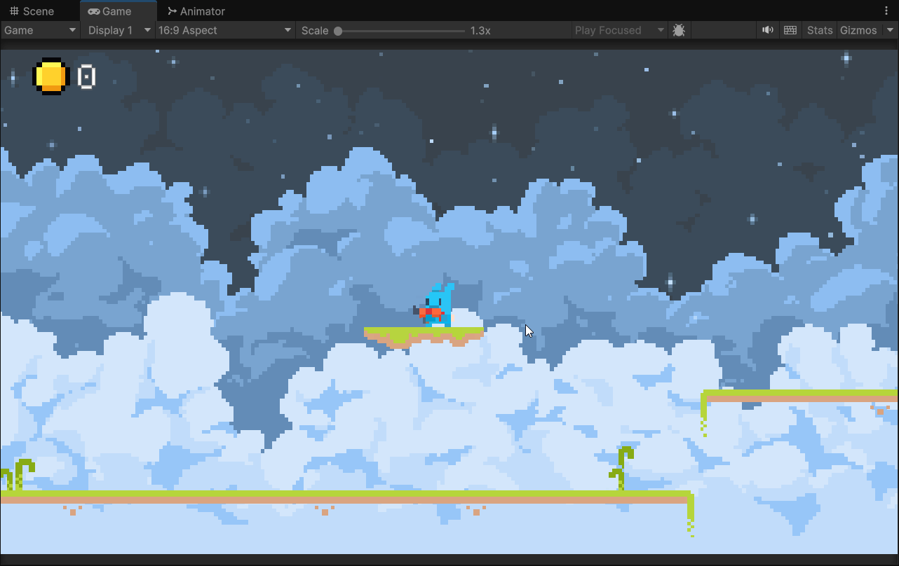
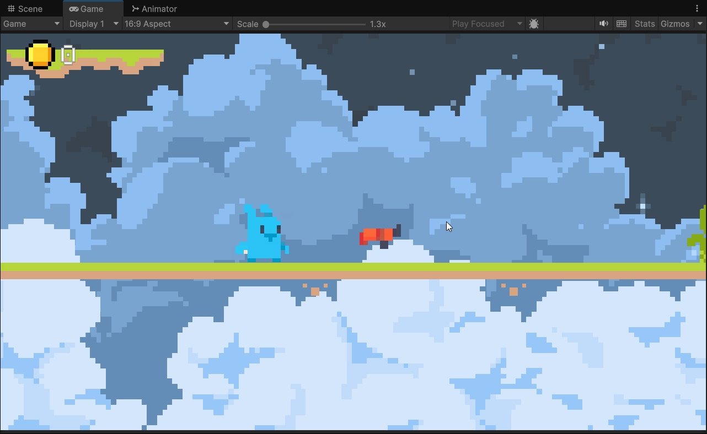
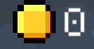
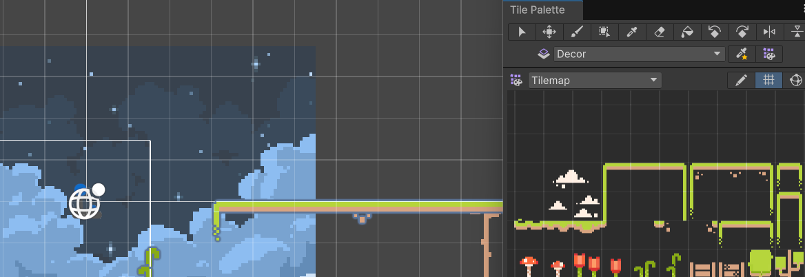
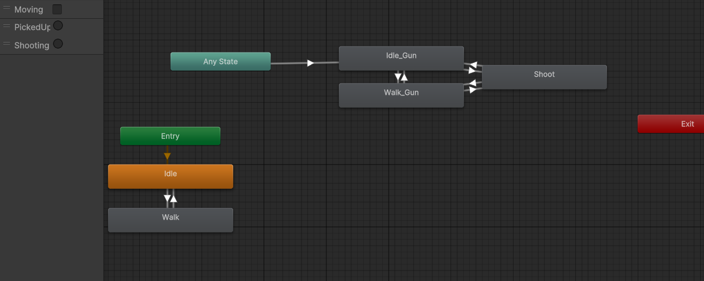

# Prototipo 2D
# Fundamentos del Desarrollo de Videojuegos
# Diego Herrera Mendoza

## El juego

Eres un pequeño conejito que se encuentra solo en unas extrañas islas. Ante ti se encuentra un arma que te permitirá pelear contra los enemigos que encontrarás en este mundo. Tu objetivo es matar a los enemigos y recolectar tantas monedas como puedas. Cualquier pequeño roce con un enemigo hará que pierdas la partida.

## Parallax

Se ha utilizado un efecto de parallax scrolling con 3 capas. Utilizando un Quad con 3 materiales transparentes, se mueve la textura en base a la posición de la cámara para dar el movimiento.

Script: [ParallaxScroll.cs](Assets/Scripts/ParallaxScroll.cs)

## Físicas

Se han implementado plataformas móviles a las que el jugador puede subirse. Utilizan un Rigidbody2D cinemático controlado por un script que mueve su posición entre dos puntos.

Script: [PointToPoint.cs](Assets/Scripts/PointToPoint.cs)

En las islas hay unas vallas colgantes que pueden interactuar con el jugador gracias a un Rigidbody2D. El efecto de cuelgue se ha conseguido gracias a los Joints de Unity, en este caso se han utilizado Hinge Joints para las partes móviles y Fixed Joints para las partes fijas.

## Object Pooling

A la hora de hacer aparecer enemigos, se ha utilizado la técnica de object pooling. El **EnemySpawner** instancia los dos tipos de enemigos existentes en sus propias pools. Son liberados al morir y reutilizados al aparecer.

Script: [EnemySpawner.cs](Assets/Scripts/EnemySpawner.cs)

## Cinemachine

Hay 2 cámaras diferentes en la escena:
1. **Cámara de enfoque inicial:** Al principio del juego se hace un enfoque al jugador y al arma hasta que se coge la misma.
2. **Cámara principal:** Es la cámara que se mantiene durante todo el juego una vez se ha cogido el arma. Mantiene al jugador en el area de confinamiento que cubre todo el nivel.

Para realizar las transiciones entre cámaras simplemente se cambian las prioridades entre las mismas desde un script **CameraManager**

Scripts: [CameraManager.cs](Assets/Scripts/CameraManager.cs)

El CinemachineImpulseSource lo he decidido poner en el **CameraManager** y escuchar a un evento del jugador al disparar para que llegue al CinemachineImpulseListener.

## Sonidos

El juego tiene sonidos para saltar, disparar, recoger monedas, golpear y ser golpeado. Todos los sonidos se han hecho utilizando la herramienta gratuita [jsfxr](https://sfxr.me/).

## UI

1. **Contador de monedas:** Muestra la cantidad de monedas obtenidas. La interfaz escucha al evento que reproducen las monedas al ser recogidas y aumentan la puntuación.

2. **Pantalla de derrota:** Se muestra al morir. Contiene un botón que permite reiniciar la escena.

Se ha diseñado la interfaz y las pantallas para que sean lo más modular posible, utilizando delegados y eventos.

## Tilemap

Toda la escena se ha construido utilizando Tilemaps, menos los elementos móviles.

Para gestionar las colisiones y la decoración de la escena, se ha dividido en las siguientes capas:
1. **Map:** La capa de mapa, tiene un Tilemap Collider 2D y un Composite Collider 2D. Es la única capa que puede navegar el jugador y los enemigos.
2. **Decor:** Sección para tiles decorativos, como las flores o los arboles.

## Animaciones

El animator del jugador es muy sencillo. Tenemos 5 estados en total. Los dos primeros (Idle y Walk) sirven para cuando aún no se ha cogido el arma. Los otros tres (Idle, Walk y Shoot) sirven para una vez se ha cogido el arma.